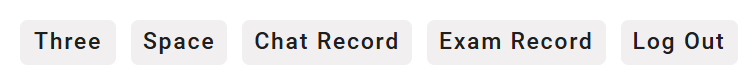
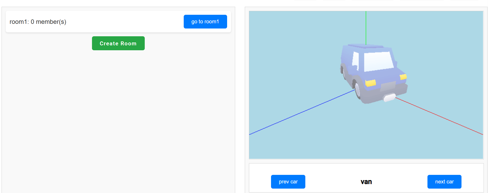

# 科目三驾驶考试平台

在一个平行世界中，人类无法进行线下驾驶。已满十八岁的成年人要取得驾照，必须通过在线考试。同时，未来的驾驶活动也将在线上进行...

## 1. 整体功能介绍

本网站主要用于帮助用户熟悉开车流程以及常见错误。用户在真正使用本网页的功能的时候，需要提前注册和登录。登陆后顶端导航栏会出现以下按钮，分别表示进入开车场景、查看个人信息、查看聊天记录、查看考试记录。



在Space中用户可以修改个人信息，并可以查看自己的违规记录。

点击Three后，会进入大厅，在这里可以创建房间供学习用，也可以进入别人创建的房间；在页面的右侧可以选择心仪的车辆。



在进入房间后，系统实时更新房间内车辆信息，保证用户之间的同步。用户之间支持私聊、房间内聊天、公聊、视频聊天，还支持和AI进行对话，聊天记录可以在chat页面进行查看。

场景由我们自己编写配置文件搭建起来，设有碰撞箱。（用户之间不会碰撞，以防止互相撞车产生影响）

在开车过程中系统会检测用户开车的违规行为并及时报告，并告诉用户正确的处理方式。在用户退出后，当前学习过程会被记录下来，可在exam-record页面查看。
现支持的违规行为检测有：
- 转弯时未打转向灯
- 超速
- 驾驶途中使用聊天功能
- 碰撞
- 频繁鸣笛

当用户在一次开车中不存在违规时，他会通过考试，拥有虚拟驾照。下次开车可以增加正式上路选项。正式上路出现的违规可以在space页面进行查看，在违规次数较多时会被吊销驾照。

## 2. 项目架构
前端： `Angular + Three.js`
利用 `Three.js` 库，为用户呈现了一个动画的驾车场景。用户可以在这个场景中驾驶汽车，进行各种操作。同时，前端还支持用户注册、登录、查看个人信息、查看聊天记录、查看考试记录等功能。

后端： `Go + Fiber + GORM`
使用 `Go` 语言编写后端，用 `GORM` 库操作数据库，使用 `Fiber` 框架，实现了用户注册、登录、查看个人信息、查看聊天记录、查看考试记录等功能。同时，后端还支持用户之间的聊天功能，用户可以在聊天室中进行文字聊天、视频聊天等操作。

通信协议：`HTTP (JSON RESTful) WebSocket Socket.io`
`HTTP` 协议用于前后端通信，`WebSocket` 协议用于用户和 AI 的聊天、视频聊天，`Socket.io` 协议用于创建虚拟房间、用户行为共享、用户之间的聊天。

部署： `Docker Compose` `Kong`
使用 `Docker Compose` 部署前后端，使用 `Kong` 作为 API 网关，实现了前后端的分离，提高了系统的安全性和可维护性。在云服务器上部署前后端，使得在任意环境下均可通过云访问，内网和公网分别部署。公网上通过 `HTTPS` 进行部署，确保安全访问和视频聊天体验。

项目运行：
```shell
docker-compose -p awb up -d
```
如需分别在本地运行，首先确保存在对应数据库，然后运行前端和后端的命令。
后端：
```shell
cd .\backend\
swag init --parseDependency --parseDepth 1
go run .
cd .\driving\
go run .
```
前端：
```shell
cd .\code\subjectThree\
ng serve
```

## 3. 代码组织

### 前端代码组织

`src/assets` 目录存放资源文件，包含 logo 图片、各种模型的资源文件以及 font 文件。

`src/app` 目录存放源代码，接下来进行详细介绍。

我们的前端主要分为两个部分，一个是 `user` 模块，用于展示个人信息；另一个是 `three` 模块，用于展示 3D 场景。此外还有一些配件，比如视频聊天、各种工具 `service` 等。

`user` 模块主要展示用户基本信息（`space`）、违规记录（`space`）、考试记录（`exam-record`）和聊天记录（`chat`）。

`three` 模块包含 `hall` 界面以及 `道路` 界面，前者用于选择车辆、进入房间，后者是主场景。这其中涉及到 `WebSocket` 的应用，相关的 `service` 进行统一管理。

### 后端代码组织

后端代码主要分为两个部分，一个是 `HTTP` 服务，用于用户注册、登录、查看个人信息、查看聊天记录、查看考试记录等功能；另一个是 `WebSocket` 服务，用于用户之间的聊天。

- `.github` 文件夹用于 `GitHub Actions` 的 CI/CD。
- `backend` 文件夹存放 `HTTP` 服务和 `WebSocket` 服务的代码
  - `api` 文件夹存放 `HTTP` 服务的代码，定义了用户注册、登录、查看个人信息、查看聊天记录、查看考试记录等接口和路由以及相关的 `schema` 结构。
  - `bootstrap` 文件夹存放 `HTTP` 服务的启动代码，包括初始化配置、路由注册、中间件注册等。
  - `config` 文件夹存放系统环境变量配置。
  - `docs` 文件夹存放接口文档，由 `Swagger` 生成。
  - `models` 文件夹存放数据库模型定义和基本操作，以及 `JWT` token 生成和校验。
  - `utils` 文件夹存放一些工具函数，如日志记录、密码加密等。
  - `Dockerfile` 以及 `.dockerignore` 文件用于构建 Docker 镜像。
- `driving` 文件夹存放 `Socket.io` 服务的代码
  - `api` 文件夹存放 `Socket.io` 服务调用 `HTTP` 服务的接口，实现了异步调用记录函数，将聊天记录添加到数据库中。
  - `config` 文件夹存放系统环境变量配置。
  - `hall` 文件夹存放 `Socket.io` 的大厅功能代码，包括房间创建、用户加入等。
  - `room` 文件夹存放 `Socket.io` 的房间功能代码，包括用户之间的聊天、行为共享等。
  - `model` 文件夹存放基本的数据结构定义。
  - `schema` 文件夹存放接口的 `schema` 定义。
  - `utils` 文件夹存放日志记录工具函数。
- `docker-compose.yaml` 文件用于部署整个系统。


## 4. 技术细节

### 前端
- 支持用户注册和登录。
- 选择相应的 Web3D 场景，可以选择模型进入不同房间。
- 虚拟化身之间相互可见，并且行为共享。
- 可以进行一定方式的交流。
- 维护虚拟世界的一致性，同一时刻各个化身能看到的场景应该是一致并且最新的。

### 后端
1. HTTP展示
- 用户后端管理页面：
  - 提供用户注册、登录、查看个人信息等功能，对用户密码进行 `md5` 加密，确保在注册和登录时调用加密函数，保障系统安全性。
  - 提供历史学习行为查看和分析功能。
- 功能细节：
  - 驾照考试记录：包括分数、开始时间、持续时间、是否有效、是否公开等信息。
  - 考试中的扣分惩罚记录：包括类型、原因、分数和时间。
  - 聊天记录的展示和添加接口。
- 数据库表结构：
  - 涉及用户、考试、聊天、惩罚等表结构。
- 接口文档：
  - 使用 `Swagger` 生成接口文档，文档说明清晰、详细。

2. 技术细节
- 使用 `slog` 库为每个请求添加日志记录。
- 创建 `JWTToken` 进行前端身份校验，通过 `JWTToken` 对接口进行鉴权，确保系统安全性，不仅对 `HTTP` 请求进行校验，还对 AI 聊天接口的 `WebSocket` 进行校验。
- 在使用 `socketio` 进行聊天时，加入异步调用记录函数，将聊天记录添加到数据库中，前端无需等待回调。
- 添加 `WebSocket` 接入 `fdunlp` `Moss` 模型，接入 AI 聊天功能，前端可以通过 `WebSocket` 接口调用 `Moss` 大模型并获得输出，同时在数据库中异步增加记录。
- 对系统并发性能进行优化，使用 `gorm` 数据库索引和自旋锁，确保并发可靠性，在 `socketio` 维护房间状态时，使用 `sync` 包进行同步，确保数据一致性。

### 进阶功能
- `Three.js`：
  - 碰撞检测。
  - 速度控制、转向控制，包括加减速、急刹车、方向盘控制。
- 系统功能：
  - 用户间交互：模拟汽车鸣笛、模拟转向灯、音视频聊天、文字聊天。
  - 扣分系统检测：环境中设置一些可交互的实体，在特定情况下触发扣分。
- 音视频聊天：
  - 使用 `WebRTC` 支持多模态交互，用户在虚拟世界中可以通过音视频进行交流。
  - 基于 `WebRTC` 实现桌面共享。
- 文字聊天：
  - 基于 `Socket.io` 实现 `room`、`private`、`global` 模式的文字聊天。
- AI聊天：
  - 接入 `Moss`，实现 AI 聊天功能。
  - 支持语义实例，支持推理
- 服务部署：
  - 见下一节。


### 服务部署和运维

系统部署分为四个容器，分别是 `数据库`、`Socket.io` 服务、`HTTP/WebSocket` 后端、`前端`。四个容器通过 `docker-compose` 进行集成，详细配置请参阅 `docker-compose.yaml` 文档和各自的 `Dockerfile` 文件。

- 基于 `docker-compose` 在云服务器上部署前后端，使得在任意环境下均可通过云访问。校园网地址为 `10.117.245.17:50080`，公网地址为 `https://p.jingyijun.xyz/`。
- 在公网通过 `https` 部署，确保安全访问。
- 利用 `GitHub Actions` 实现 CI/CD，代码更新后自动构建并上传到 `Docker Hub`。
- 隐私数据如 `APIKey` 等存储在服务器的环境变量中，确保安全性。

## 5. 项目成员
- 张文擘 21307110084 负责后端开发、部署、前端部分bug修复
- 钟杰铖 21302010025 前端场景开发、汽车控制逻辑、物理引擎引入\
- 李文昊 21302010007 场景素材选取、场景构建拼接、前端部分服务编写与bug修复